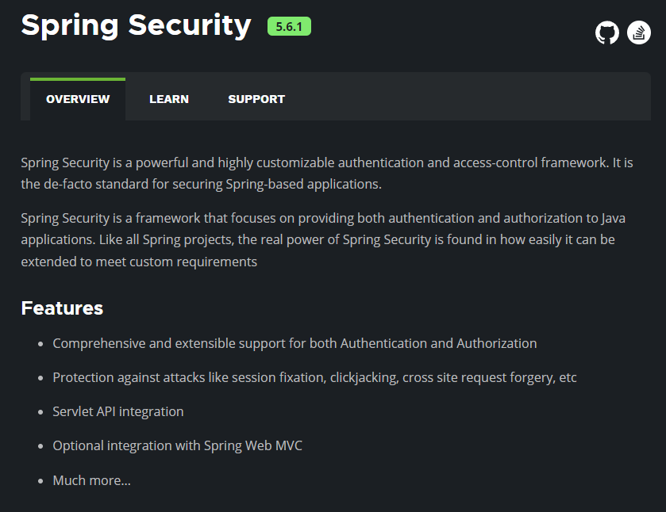

# Spring Security v5.6 学习总结
### 以上描述观点全部为各人见解，如何错误之处请大家指出，我在此十分感谢您的指点，并且这是一个初入此框架门槛的人员的记录，对于您可能来说不会有太大的帮助，如果您需要一个非常全面，而且十分有权威的教程，请您另谋它路。 

#### 前言
##### 既然说到了Spring Security 那么我们首先应该先了解一下这是一个什么样的产品；我们使用它可以帮助我们达成什么样的目的；我们应该如何去使用它；它是怎么样做到这些功能；是如何实现的等等。这其实就架构师在系统设计框架选择时所需要做的工作，首先要明确自己的**_需求_**，根据我们的需求去定型软件架构，其次我们要去了解选择的框架的功能是否可以解决我们的需求，再其次也是十分重新的一点，我们应该去了解框架的原理是如何实现的，并且需要对框架的扩展性给出评定。~~来自于一个工作两年的程序员的陈述~~

### 1. Spring Security是一个什么样的产品？

#### 译文：Spring Security 是一个功能强大且高度可定制的身份验证和访问控制框架。它是保护基于 Spring 的应用程序的事实上的标准。
#### Spring Security 是一个专注于为 Java 应用程序提供身份验证和授权的框架。与所有 Spring 项目一样，Spring Security 的真正强大之处在于它可以轻松扩展以满足自定义要求
#### 特征
- 对身份验证和授权的全面且可扩展的支持
- 防止会话固定、点击劫持、跨站点请求伪造等攻击
- Servlet API 集成
- 与 Spring Web MVC 的可选集成
### 总结：由以上描述我们可知，Spring Security 框架是为了保护 Spring 应该程序的，并且它是保护Spring程序的一种标准，并且有着高强度的自定义与扩展性。核心功能身份验证、授权以及其它功能。

### 2. Spring Security做了那些功能，是如何帮我们实现的这些功能，待明天更新？